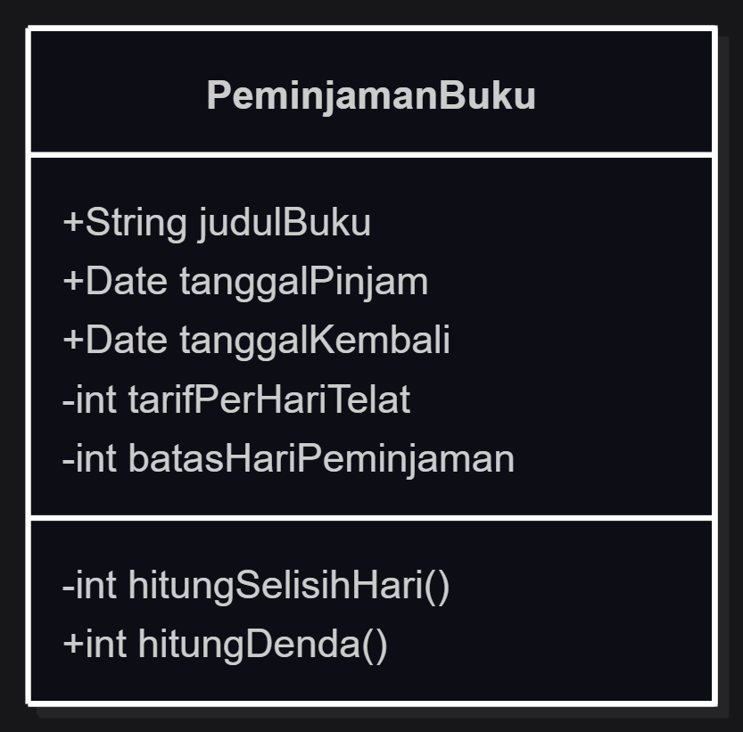
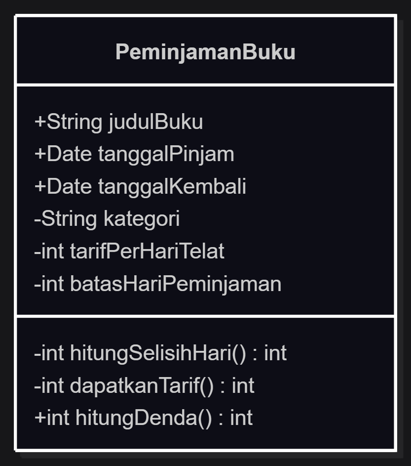

# Refleksi — OOP vs Prosedural & Peran AI dalam Pengembangan

## Tabel Refleksi Tren Pendekatan Pengembangan

| Pendekatan | Kekuatan | Risiko/Batasan | Contoh penggunaan |
|---|---|---|---|
| **OOP tradisional** | Encapsulation menjaga konsistensi data; inheritance & polymorphism memudahkan reuse kode; kode terorganisir per entitas; mudah dipelihara untuk skala besar | Learning curve lebih tinggi; bisa terjadi over-engineering untuk proyek sederhana; kompleksitas desain (abstraction, inheritance chain) | Sistem perpustakaan digital, aplikasi enterprise, game engine, framework UI |
| **AI-assisted development** | Produktivitas meningkat drastis; cepat prototyping; bantu debugging, refactoring, dan generate boilerplate; akses ke solusi dari ribuan proyek | Kode hasil AI belum tentu optimal atau aman; risiko plagiarisme lisensi; developer jadi ketergantungan dan kehilangan pemahaman fundamental | GitHub Copilot, ChatGPT untuk generate kode, autocomplete, code review, test generation |
| **Cloud-native** | Skalabilitas horizontal otomatis; high availability; deployment cepat via CI/CD; pay-as-you-go | Kompleksitas infrastruktur (container, orchestration); vendor lock-in; biaya bisa membengkak jika tidak dimonitor | Microservices, serverless functions (AWS Lambda), containerized apps (Docker + Kubernetes) |
| **Low-code/no-code** | Delivery sangat cepat; minim coding; memberdayakan non-programmer; cocok untuk MVP | Kustomisasi terbatas; vendor lock-in; scalability buruk; sulit maintenance jangka panjang | Form builder, workflow automation, dashboard sederhana, aplikasi internal perusahaan |

## Refleksi: Kapan OOP Lebih Tepat?

### Skala dan Karakteristik Proyek yang Cocok untuk OOP

OOP lebih tepat digunakan pada proyek berskala menengah hingga besar yang memiliki banyak entitas dengan relasi kompleks. Contohnya adalah sistem perpustakaan digital: ada entitas Buku, Anggota, Peminjaman, Denda — masing-masing memiliki data dan perilaku sendiri. OOP memungkinkan setiap entitas dibungkus dalam class, sehingga kode lebih terorganisir dan mudah dipahami. Proyek dengan aturan bisnis yang sering berubah juga sangat diuntungkan oleh OOP, karena perubahan cukup dilakukan di satu tempat (misal: method `#dapatkanTarif()`) tanpa menyentuh kode pemanggil. Tim pengembang besar juga lebih diuntungkan karena encapsulation membatasi efek samping antar modul — setiap developer bisa bekerja pada class berbeda tanpa saling mengganggu.

Sebaliknya, pendekatan prosedural masih relevan untuk proyek kecil dengan logika linear. Script satu kali, program CLI sederhana, atau fungsi komputasi murni (input → proses → output) justru lebih ringkas dan efisien ditulis secara prosedural. Tidak ada gunanya membuat class hierarchy untuk program 50 baris yang hanya memproses file CSV. Intinya: OOP memberi struktur dan maintainability, prosedural memberi kesederhanaan dan kecepatan untuk tugas sederhana.

### Peran AI: Asisten, Bukan Pengganti

AI dapat menjadi asisten yang sangat membantu dalam pengembangan perangkat lunak, tetapi tidak bisa menggantikan pemahaman fundamental OOP. AI dapat membantu generate boilerplate code, memberikan saran refactoring, menulis test cases, dan membantu debugging. Namun, AI tidak memahami konteks bisnis proyek, trade-off desain arsitektur, atau kebutuhan spesifik pengguna. Kode yang dihasilkan AI sering kali terlihat benar secara sintaks tetapi salah secara semantik — misalnya menggunakan inheritance ketika composition lebih tepat, atau melanggar prinsip encapsulation.

Oleh karena itu, developer tetap harus menguasai OOP fundamentals untuk bisa menilai, mereview, dan memperbaiki output AI. AI mempercepat eksekusi, tetapi keputusan desain tetap ada di tangan developer. Kombinasi pemahaman fundamental yang kuat + AI sebagai tools adalah pendekatan terbaik: developer mendesain arsitektur dan AI membantu mengimplementasikan detail teknis.

### Kesimpulan

OOP unggul untuk proyek kompleks, tim besar, dan aturan bisnis yang dinamis. AI-assisted development meningkatkan produktivitas tetapi membutuhkan fondasi OOP yang kuat dari developernya. Keduanya bukan lawan, melainkan alat yang saling melengkapi — asalkan developer tidak kehilangan pemahaman fundamental di tengah kemudahan yang ditawarkan AI.

---

## Dokumentasi Tugas Modifikasi

### Tabel Perbandingan — Sebelum (`index.js`) vs Sesudah (`modify.js`)

| Aspek | Sebelum (index.js) | Sesudah (modify.js) |
|-------|-------------------|-------------------|
| **Param prosedural** | `(judulBuku, tanggalPinjam, tanggalKembali)` | `(judulBuku, **kategori**, tanggalPinjam, tanggalKembali)` |
| **Logika denda prosedural** | `telat * tarifPerHari` (fixed) | `kategori === "Referensi" ? tarif*2 : tarif` |
| **Class PeminjamanBuku** | Tidak punya field kategori | Private field `#kategori` + method `#dapatkanTarif()` |
| **Aturan bisnis** | Tersebar di `hitungDenda()` | Terpusat di `#dapatkanTarif()` — private & terenkapsulasi |
| **Test case** | 1 skenario | 2 skenario (Referensi x2 + Fiksi normal) |
| **Perbandingan final** | Tidak ada | Ada section perbandingan di akhir kode |

### Class Diagram — Sebelum Modify



### Class Diagram — Sesudah Modify



### Code Diff — Penjelasan Detail Perubahan Kode

Bagian ini menjelaskan langkah demi langkah apa yang berubah dari `index.js` (sebelum) ke `modify.js` (sesudah), serta **mengapa** perubahan itu penting dalam konsep OOP.

---

#### A. Sisi Prosedural

**Sebelum — index.js:**
```js
function buatPeminjamanProsedural(judulBuku, tanggalPinjam, tanggalKembali) {
  return { judulBuku, tanggalPinjam, tanggalKembali };
}

function hitungDendaProsedural(peminjaman, tarifPerHari = 500) {
  const batasHari = 7;
  const selisihHari = Math.floor(
    (peminjaman.tanggalKembali - peminjaman.tanggalPinjam) / (1000 * 60 * 60 * 24)
  );
  const telat = Math.max(0, selisihHari - batasHari);
  return telat * tarifPerHari;  // tarif tetap, tidak ada pengecekan kategori
}
```
**Penjelasan:**
- `buatPeminjamanProsedural()` mengembalikan **plain object** biasa — tidak ada hubungan antara data ini dengan fungsi yang memprosesnya.
- `hitungDendaProsedural()` menerima objek peminjaman lalu menghitung denda. Tarif selalu Rp500/hari untuk semua buku — **tidak bisa membedakan kategori Referensi dengan kategori lain**.
- **Masalah:** Data dan logika terpisah. Jika suatu saat aturan berubah (misal: denda x2 untuk Referensi), setiap kode yang memanggil `hitungDendaProsedural()` harus diperiksa satu per satu.

**Sesudah — modify.js:**
```js
function buatPeminjamanProsedural(judulBuku, kategori, tanggalPinjam, tanggalKembali) {
  return { judulBuku, kategori, tanggalPinjam, tanggalKembali };
}

function hitungDendaProsedural(peminjaman, tarifPerHari = 500) {
  const batasHari = 7;
  const selisihHari = Math.floor(
    (peminjaman.tanggalKembali - peminjaman.tanggalPinjam) / (1000 * 60 * 60 * 24)
  );
  const telat = Math.max(0, selisihHari - batasHari);
  const tarifAktual = peminjaman.kategori === "Referensi" ? tarifPerHari * 2 : tarifPerHari;
  return telat * tarifAktual;
}
```
**Penjelasan perubahan:**
- Parameter `kategori` ditambahkan ke `buatPeminjamanProsedural()`.
- Pada `hitungDendaProsedural()`, ditambahkan baris: `const tarifAktual = peminjaman.kategori === "Referensi" ? tarifPerHari * 2 : tarifPerHari;`
- **Kelemahan masih ada:** Aturan pengecekan kategori ini *tersebar* di dalam fungsi. Jika ada 50 tempat di program yang memanggil `hitungDendaProsedural()`, semuanya harus diubah jika aturan berubah.

---

#### B. Sisi OOP

**Apa itu class?** Class adalah *blueprint* atau cetakan untuk membuat objek. Di sini `PeminjamanBuku` adalah cetakan untuk membuat objek peminjaman yang memiliki data (atribut) dan perilaku (method) dalam satu kesatuan.

**Apa itu constructor?** Method spesial yang otomatis dijalankan saat objek dibuat dengan `new PeminjamanBuku(...)`. Ia menerima data awal dan menyimpannya ke atribut objek.

**Apa itu private field (`#`)?** Atribut yang diawali `#` (misal: `#tarifPerHariTelat`) hanya bisa diakses dari dalam class — tidak bisa diubah dari luar. Ini adalah **encapsulation** (mengamankan data dari intervensi luar).

---

**Sebelum — index.js (tanpa kategori):**
```js
class PeminjamanBuku {
  #tarifPerHariTelat = 500;       // Private: tarif denda per hari
  #batasHariPeminjaman = 7;       // Private: batas maksimal hari

  constructor(judulBuku, tanggalPinjam, tanggalKembali) {
    this.judulBuku = judulBuku;
    this.tanggalPinjam = tanggalPinjam;
    this.tanggalKembali = tanggalKembali;
  }

  hitungDenda() {
    const telat = Math.max(0, this.#hitungSelisihHari() - this.#batasHariPeminjaman);
    return telat * this.#tarifPerHariTelat;  // tarif tetap Rp500
  }
}
```
**Penjelasan langkah demi langkah:**

1. **Baris 2-3 — Private field:** `#tarifPerHariTelat = 500` dan `#batasHariPeminjaman = 7` disimpan sebagai data internal class. Tidak ada kode di luar class yang bisa mengakses atau mengubahnya langsung — terjaga konsistensinya.

2. **Baris 5-8 — Constructor:** Saat `new PeminjamanBuku("Clean Code", date1, date2)` dipanggil, constructor menyimpan:
   - `this.judulBuku = "Clean Code"`
   - `this.tanggalPinjam = date1`
   - `this.tanggalKembali = date2`

3. **Baris 10-12 — Method `hitungDenda()`:** Alur kerja:
   - Panggil `#hitungSelisihHari()` (private method) → menghitung durasi pinjam dalam hari
   - Kurangi dengan `#batasHariPeminjaman` (7 hari) → dapat jumlah hari telat
   - `Math.max(0, ...)` → jika tidak telat, hasilnya 0
   - Kalikan dengan `#tarifPerHariTelat` (Rp500) → total denda

**Kelemahan:** Tarif selalu Rp500 untuk semua kategori buku. Tidak ada cara untuk membedakan denda buku Referensi dengan buku Fiksi.

---

**Sesudah — modify.js (dengan kategori & aturan x2):**
```js
class PeminjamanBuku {
  #tarifPerHariTelat = 500;       // Private: tarif denda per hari
  #batasHariPeminjaman = 7;       // Private: batas maksimal hari
  #kategori;                       // Private: kategori buku (BARU)

  constructor(judulBuku, kategori, tanggalPinjam, tanggalKembali) {
    this.judulBuku = judulBuku;
    this.#kategori = kategori;     // Simpan kategori (BARU)
    this.tanggalPinjam = tanggalPinjam;
    this.tanggalKembali = tanggalKembali;
  }

  #dapatkanTarif() {               // Private method BARU
    return this.#kategori === "Referensi"
      ? this.#tarifPerHariTelat * 2   // Referensi: Rp1000/hari
      : this.#tarifPerHariTelat;      // Lainnya: Rp500/hari
  }

  hitungDenda() {
    const telat = Math.max(0, this.#hitungSelisihHari() - this.#batasHariPeminjaman);
    return telat * this.#dapatkanTarif();  // Tarif dinamis sesuai kategori
  }
}
```
**Penjelasan 3 perubahan utama:**

**1. Private field baru — `#kategori` (baris 4)**
- Field ini menyimpan kategori buku (misal: `"Referensi"`, `"Fiksi"`, `"Akademik"`).
- Bersifat private (`#`) — tidak bisa diubah sembarangan dari luar class.

**2. Constructor ditambah parameter `kategori` (baris 6-10)**
- Sebelum: `constructor(judulBuku, tanggalPinjam, tanggalKembali)`
- Sesudah: `constructor(judulBuku, kategori, tanggalPinjam, tanggalKembali)`
- Nilai `kategori` langsung disimpan ke `this.#kategori`.

**3. Method baru — `#dapatkanTarif()` (baris 12-16)**
- Method private ini berisi **aturan bisnis** penentuan tarif denda:
  - Jika `this.#kategori === "Referensi"` → tarif Rp500 × 2 = **Rp1000/hari**
  - Selain itu → tarif normal **Rp500/hari**
- **Kenapa ini penting?** Aturan bisnis sekarang **terpusat di satu tempat**. Jika di masa depan aturan berubah (misal: Referensi jadi x3, atau kategori "Langka" denda x5), cukup ubah method `#dapatkanTarif()` saja — tidak perlu menyentuh kode lain.

**4. `hitungDenda()` didelegasikan ke `#dapatkanTarif()` (baris 18-21)**
- Sebelum: `return telat * this.#tarifPerHariTelat` (tarif tetap)
- Sesudah: `return telat * this.#dapatkanTarif()` (tarif dinamis)
- `hitungDenda()` tidak perlu tahu cara tarif dihitung — ia tinggal memakai hasil dari `#dapatkanTarif()`. Ini contoh **Separation of Concerns** (pemisahan tanggung jawab).

---

**Apa yang terjadi saat `pinjam2.hitungDenda()` dipanggil?**

Misal objek dibuat dengan:
```js
new PeminjamanBuku("Clean Code", "Referensi", new Date("2026-01-01"), new Date("2026-01-12"))
```

**Alur eksekusi untuk kategori "Referensi":**

| Langkah | Proses | Hasil |
|---------|--------|-------|
| 1 | `#hitungSelisihHari()` → selisih 1 Jan s.d. 12 Jan | 11 hari |
| 2 | Kurangi `#batasHariPeminjaman` (7) → 11 - 7 | 4 hari telat |
| 3 | Panggil `#dapatkanTarif()` → kategori `"Referensi"` | Rp500 × 2 = **Rp1000** |
| 4 | 4 hari × Rp1000 | **Rp5000** ✅ |

**Bandingkan dengan kategori "Fiksi":**

| Langkah | Proses | Hasil |
|---------|--------|-------|
| 1 | `#hitungSelisihHari()` | 11 hari |
| 2 | 11 - 7 | 4 hari telat |
| 3 | `#dapatkanTarif()` → bukan "Referensi" | **Rp500** (normal) |
| 4 | 4 × Rp500 | **Rp2500** |

Perbedaan hanya di **Langkah 3**: method `#dapatkanTarif()` mengembalikan tarif berbeda tergantung kategori. Inilah inti dari **encapsulation** — aturan bisnis dibungkus rapi dalam satu method, dan pemanggil (`hitungDenda()`) tidak perlu tahu detailnya.

### Output Terminal — Sebelum vs Sesudah

**Output `index.js` (sebelum):**
```
Denda (prosedural): Rp2500
Denda (OOP): Rp2500
```
Hanya 1 skenario, tanpa kategori.

**Output `modify.js` (sesudah):**
```
Denda (prosedural, Referensi): Rp5000
Denda (prosedural, Fiksi):     Rp2500
Denda (OOP, Referensi): Rp5000
Denda (OOP, Fiksi):     Rp2500
```
2 skenario — Referensi (x2) vs normal — membuktikan aturan baru berfungsi.

### Perbandingan Letak Aturan Bisnis

| Approach | File:Baris | Di mana aturan `kategori === "Referensi"` ditulis? |
|----------|-----------|---------------------------------------------------|
| **Prosedural** | `modify.js:24` | Di dalam fungsi `hitungDendaProsedural()` — jika ada 50 caller, semua harus *ingat* mengecek kategori manual |
| **OOP** | `modify.js:73-76` | Di dalam private method `#dapatkanTarif()` — terpusat, perubahan cukup di 1 tempat |

### Refleksi Spesifik dari Modifikasi Ini

Apa yang saya pelajari dari modifikasi ini? Saat menambahkan aturan kategori Referensi denda x2, pendekatan **prosedural** memaksa saya mencari dan mengubah fungsi `hitungDendaProsedural()` — jika kode sudah besar, ini rawan terlewat. Sebaliknya, pendekatan **OOP** cukup menambah `#kategori` sebagai private field dan method `#dapatkanTarif()` baru, tanpa mengubah method `hitungDenda()` sama sekali. Ini membuktikan encapsulation benar-benar memudahkan maintenance.

Selain itu, pendekatan prosedural menempatkan tanggung jawab pengecekan kategori pada **setiap pemanggil** fungsi — artinya jika ada 50 tempat pemanggilan `hitungDendaProsedural()`, dan aturan berubah (misal: kategori "Langka" juga x2), maka 50 tempat itu harus diubah satu per satu. Sedangkan OOP cukup mengubah satu baris di `#dapatkanTarif()`, dan semua objek langsung mengikuti aturan baru. Ini adalah contoh nyata prinsip **Open/Closed** (OCP) dari SOLID.
