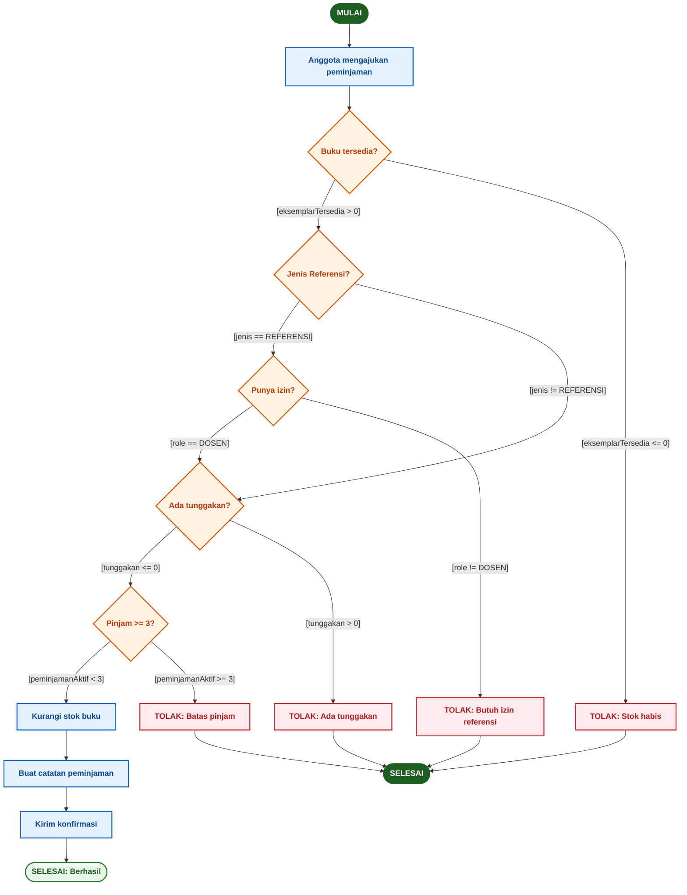

# Activity Diagram — Proses Peminjaman Buku

## Diagram Alur

---

## Daftar Guard Condition

| No | Decision Node | Guard Condition (Ya) | Guard Condition (Tidak) | Aksi jika Tidak |
|:--:|--------------|--------------------:|-----------------------:|:--------------:|
| 1 | Buku tersedia? | `[eksemplarTersedia > 0]` | `[eksemplarTersedia <= 0]` | TOLAK: Stok habis |
| 2 | Jenis Referensi? | `[jenis == REFERENSI]` | `[jenis != REFERENSI]` | Lanjut ke cek tunggakan |
| 3 | Punya izin? | `[role == DOSEN]` | `[role != DOSEN]` | TOLAK: Butuh izin referensi |
| 4 | Ada tunggakan? | `[tunggakan <= 0]` | `[tunggakan > 0]` | TOLAK: Ada tunggakan |
| 5 | Pinjam >= 3? | `[peminjamanAktif < 3]` | `[peminjamanAktif >= 3]` | TOLAK: Batas pinjam |

---

## Keterangan Warna Diagram

| Warna | Makna |
|-------|-------|
| ■ Biru | Proses / aksi |
| ■ Oranye | Decision node (percabangan) |
| ■ Merah | Penolakan / gagal |
| ■ Hijau | Mulai / Selesai (sukses) |
