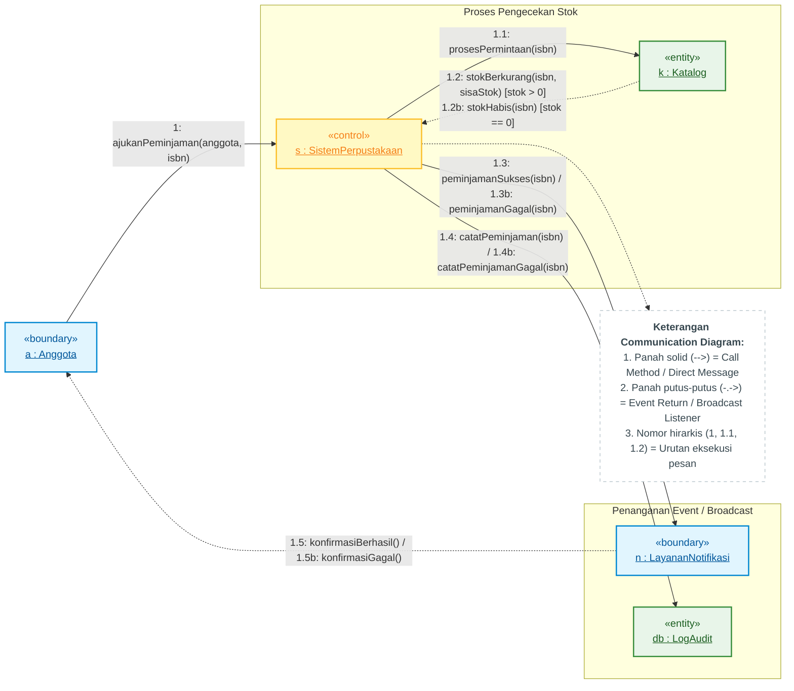
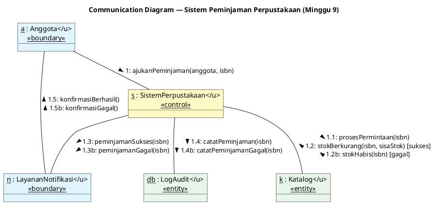

# Communication Diagram — Sistem Peminjaman Perpustakaan (Minggu 9)

**Mata Kuliah:** Perancangan Berbasis Objek  
**Materi:** Minggu 9 — Communication Diagram (UML Interaction Diagram)  
**Baseline Kode:** [`index.js`](file:///D:/SEMESTER_ANTARA/Perancangan_Berbasis_Objek/Latihan_Pengerjaan/week-9/index.js)

---

## 1. Konsep Utama Communication Diagram

**Communication Diagram** (sebelumnya disebut *Collaboration Diagram* pada UML 1.x) adalah jenis diagram interaksi UML yang menekankan **struktur organisasi objek** yang saling bertukar pesan.

Berbeda dengan *Sequence Diagram* yang berfokus pada garis waktu vertikal, Communication Diagram menampilkan:
1. **Objek & Hubungan (Link):** Jaringan objek bertipe *Boundary*, *Control*, dan *Entity* (arsitektur BCE).
2. **Penomoran Pesan Hirarkis (Sequence Numbering):** Menunjukkan urutan eksekusi pesan (contoh: `1`, `1.1`, `1.2`).
3. **Arah Pesan:** Ditandai dengan panah penunjuk arah pada garis asosiasi/link.

---

## 2. Diagram Mermaid (Graph LR)

---

## 3. Diagram PlantUML Code

File PlantUML tersimpan di [`diagram/communication_diagram.puml`](file:///D:/SEMESTER_ANTARA/Perancangan_Berbasis_Objek/Latihan_Pengerjaan/week-9/diagram/communication_diagram.puml):

---

## 4. Tabel Rincian Pesan & Traceability Kode

| No Pesan | Pengirim | Penerima | Nama Pesan / Method | Tipe Komunikasi | Sumber Kode di `index.js` |
|:--------:|:---------|:---------|:---------------------|:---------------|:-------------------------|
| **1** | `a : Anggota` | `s : SistemPerpustakaan` | `ajukanPeminjaman(anggota, isbn)` | Direct Call | `sistem.ajukanPeminjaman({ nama: "Rani" }, "978-1")` |
| **1.1** | `s : SistemPerpustakaan` | `k : Katalog` | `prosesPermintaan(isbn)` | Direct Call | `this.#katalog.prosesPermintaan(isbn)` |
| **1.2** | `k : Katalog` | `s : SistemPerpustakaan` | `emit("stokBerkurang", ...)` *(Sukses)* | Event Response | `this.emit("stokBerkurang", { isbn, sisaStok })` |
| **1.2b** | `k : Katalog` | `s : SistemPerpustakaan` | `emit("stokHabis", ...)` *(Gagal)* | Event Response | `this.emit("stokHabis", { isbn })` |
| **1.3** | `s : SistemPerpustakaan` | `n : LayananNotifikasi` | `emit("peminjamanSukses", ...)` | Event Broadcast | `sistem.on("peminjamanSukses", ...)` |
| **1.3b** | `s : SistemPerpustakaan` | `n : LayananNotifikasi` | `emit("peminjamanGagal", ...)` | Event Broadcast | `sistem.on("peminjamanGagal", ...)` |
| **1.4** | `s : SistemPerpustakaan` | `db : LogAudit` | `catatPeminjaman(isbn)` | Event Listener | `this.#riwayat.push(...)` |
| **1.5** | `n : LayananNotifikasi` | `a : Anggota` | `konfirmasiBerhasil()` | UI Notification | `console.log("1.5: LayananNotifikasi --> Anggota: konfirmasi berhasil")` |

---

## 5. Komparasi: Communication Diagram vs Sequence Diagram

| Aspek | Communication Diagram | Sequence Diagram |
|:---|:---|:---|
| **Fokus Utama** | Organisasi struktural & relasi antar objek. | Urutan waktu (chronological order) dari atas ke bawah. |
| **Penggunaan Ruang** | Lebih hemat tempat (berbentuk grafik net/web). | Membutuhkan area vertikal yang panjang. |
| **Penomoran Pesan** | **Wajib** memakai penomoran hirarkis (`1`, `1.1`, `1.2`). | Implisit berdasarkan garis waktu vertikal. |
| **Penggunaan Ideal** | Menggambarkan arsitektur komponen & event-driven decoupling. | Menggambarkan alur eksekusi detail per milidetik. |
