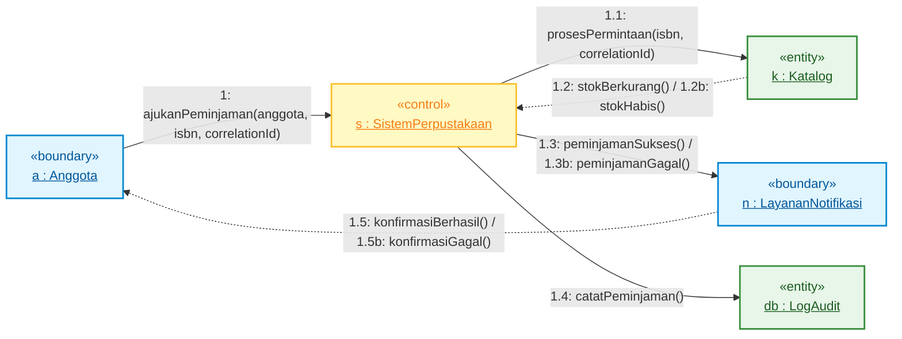

# Laporan Tugas Minggu 9 — Communication Diagram & Event-Driven Architecture

**Nama:** Ahmad Rassya Maulana  
**NIM:** 20250140157  
**Mata Kuliah:** Perancangan Berbasis Objek  
**Materi:** Minggu 9 — Communication Diagram, Event-Driven Architecture, Correlation ID & Coupling Analysis  
**File Utama:** [`week-9/modify.js`](file:///D:/SEMESTER_ANTARA/Perancangan_Berbasis_Objek/Latihan_Pengerjaan/week-9/modify.js)

---

## 1. Ringkasan Tugas

Tugas pada Minggu 9 berfokus pada **Communication Diagram** (UML Interaction Diagram) dan penerapannya pada arsitektur sistem berbasis event (`EventEmitter` / Publish-Subscribe):
1. **Tugas 1 (Correlation ID & Tracing):** Menambahkan `correlationId` unik pada setiap pesan/event transaksi agar alur pesan antar-objek dapat ditelusuri secara presisi (*distributed tracing*).
2. **Tugas 2 (Analisis Komparatif):** Membandingkan pemanggilan langsung (*Direct Call*) dengan arsitektur berbasis event (*Event-Driven*) dari dua sudut pandang utama: **Coupling** (keterikatan) dan **Debugging** (penelusuran kesalahan).

---

## 2. Struktur File Minggu 9

| Berkas | Status | Deskripsi & Peran |
|:---|:---:|:---|
| [`week-9/index.js`](file:///D:/SEMESTER_ANTARA/Perancangan_Berbasis_Objek/Latihan_Pengerjaan/week-9/index.js) | Baseline | Kode awal contoh komunikasi `EventEmitter` tanpa Correlation ID. |
| [`week-9/modify.js`](file:///D:/SEMESTER_ANTARA/Perancangan_Berbasis_Objek/Latihan_Pengerjaan/week-9/modify.js) | **Hasil Modifikasi** | Kode solusi Tugas 1 (Correlation ID) & Tugas 2 (Tabel + Analisis Komparatif). |
| [`week-9/diagram/communication_diagram.mmd`](file:///D:/SEMESTER_ANTARA/Perancangan_Berbasis_Objek/Latihan_Pengerjaan/week-9/diagram/communication_diagram.mmd) | Diagram | Spesiifikasi Communication Diagram UML format Mermaid. |
| [`week-9/diagram/communication_diagram.puml`](file:///D:/SEMESTER_ANTARA/Perancangan_Berbasis_Objek/Latihan_Pengerjaan/week-9/diagram/communication_diagram.puml) | Diagram | Spesifikasi Communication Diagram UML format PlantUML. |
| [`week-9/diagram.md`](file:///D:/SEMESTER_ANTARA/Perancangan_Berbasis_Objek/Latihan_Pengerjaan/week-9/diagram.md) | Dokumentasi | Panduan teknis & rincian urutan pesan Communication Diagram. |

---

## 3. Penjelasan Tugas 1 — Correlation ID & Transaction Tracing

### Problem Statement
Pada arsitektur *Event-Driven*, beberapa event dari berbagai transaksi dapat dipancarkan secara konkuren. Tanpa pengenal transaksi, log event dari transaksi berbeda akan tercampur aduk dan sulit dilacak event mana yang milik transaksi mana.

### Solusi di [`modify.js`](file:///D:/SEMESTER_ANTARA/Perancangan_Berbasis_Objek/Latihan_Pengerjaan/week-9/modify.js)
Menambahkan parameter `correlationId` (misalnya `TXN-1001`, `TXN-1002`) yang diteruskan ke seluruh alur pemanggilan method dan pemancaran event:
1. `ajukanPeminjaman(anggota, isbn, correlationId)`
2. `prosesPermintaan(isbn, correlationId)`
3. Event `stokBerkurang` / `stokHabis`: membawa `{ isbn, sisaStok, correlationId }`
4. Event `peminjamanSukses` / `peminjamanGagal`: membawa `{ isbn, correlationId }`
5. `LayananNotifikasi` dan `LogAudit`: mencatat log transaksi lengkap beserta `correlationId`.

### Hasil Log Eksekusi:
```text
--- Memulai Transaksi: [TXN-1001] ---
[TXN-1001] 1: Anggota(Rani) --> SistemPerpustakaan: ajukanPeminjaman(978-1)
[TXN-1001] 1.1: SistemPerpustakaan --> Katalog: prosesPermintaan(978-1)
[TXN-1001] 1.2: Katalog --> SistemPerpustakaan: stokBerkurang(978-1, sisa: 0)
[TXN-1001] 1.3: SistemPerpustakaan --> LayananNotifikasi: peminjamanSukses(978-1)
[TXN-1001] 1.5: LayananNotifikasi --> Anggota: Konfirmasi berhasil dikirim
[TXN-1001] 1.4: SistemPerpustakaan --> LogAudit: catatPeminjamanSukses()

--- Memulai Transaksi: [TXN-1002] ---
[TXN-1002] 1: Anggota(Budi) --> SistemPerpustakaan: ajukanPeminjaman(978-1)
[TXN-1002] 1.1: SistemPerpustakaan --> Katalog: prosesPermintaan(978-1)
[TXN-1002] 1.2: Katalog --> SistemPerpustakaan: stokHabis(978-1)
[TXN-1002] 1.3: SistemPerpustakaan --> LayananNotifikasi: peminjamanGagal(978-1)
[TXN-1002] 1.5: LayananNotifikasi --> Anggota: Konfirmasi gagal dikirim (Stok Habis)
[TXN-1002] 1.4: SistemPerpustakaan --> LogAudit: catatPeminjamanGagal()

--- REKAP LOG AUDIT TRANSACTION TRACING ---
[TXN-1001] Peminjaman ISBN 978-1 BERHASIL pada 2026-08-18T01:09:01.109Z
[TXN-1002] Peminjaman ISBN 978-1 GAGAL (Stok Habis) pada 2026-08-18T01:09:01.110Z
```

---

## 4. Penjelasan Tugas 2 — Analisis Perbandingan Direct Call vs Event-Driven

| Kriteria | Direct Call (Metode Konvensional) | Event-Driven Architecture (Pub-Sub / EventEmitter) |
|:---|:---|:---|
| **1. Coupling** *(Keterikatan)* | **Tight Coupling (Keterikatan Tinggi)**<br/>• Object pengirim harus menyimpan referensi fisik dan mengetahui metode spesifik milik object penerima.<br/>• Menambah komponen baru (misal: fitur SMS Notification / Audit Log) menuntut modifikasi pada kode pengirim utama (*violates Open/Closed Principle*). | **Loose Coupling (Decoupled / Keterikatan Rendah)**<br/>• Publisher hanya memancarkan event ke bus/emitter tanpa perlu tahu siapa atau berapa listener yang mendengarkannya.<br/>• Menambah listener baru cukup memanggil `.on()` tanpa perlu mengubah satu baris pun kode pada publisher. |
| **2. Debugging** *(Penelusuran Error)* | **Lebih Mudah (Synchronous Call Stack)**<br/>• Stack trace berjalan linier dari awal pemanggilan hingga akhir.<br/>• Mudah dilacak dengan breakpoint atau debugger standar (*step-over / step-into*). | **Lebih Kompleks (Membutuhkan Correlation ID)**<br/>• Call stack terputus pada perantara event emitter (terutama pada komunikasi asinkron/terdistribusi).<br/>• **Correlation ID** sangat krusial untuk menghubungkan kembali kepingan event menjadi satu urutan transaksi yang utuh. |

---

## 5. Ringkasan Communication Diagram



---

## 6. Cara Menjalankan

Jalankan perintah berikut pada terminal:

```bash
node week-9/modify.js
```

---

## 7. Kesimpulan

- **Correlation ID** menyelesaikan tantangan *traceability* pada sistem event-driven dengan memberikan penanda identifikasi tunggal pada setiap transaksi.
- **Event-Driven Architecture** sangat unggul dari segi **Loose Coupling** dan fleksibilitas pengembangan sistem, namun memerlukan disiplin logging dan **Correlation ID** untuk mempermudah proses **Debugging**.
